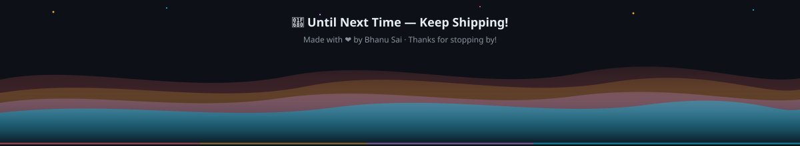

<!-- ===== HEADER CAPSULE ===== -->
<p align="center">
  
</p>

<!-- ===== HERO BANNER ===== -->
<p align="center">
  
</p>

<!-- ===== DIVIDER ===== -->
<p align="center">
  
</p>

<!-- ===== TYPING EFFECT ===== -->
<p align="center">
  <a href="https://github.com/bhanusaiyarasu">
    
  </a>
</p>

<!-- ===== DIVIDER ===== -->
<p align="center">
  
</p>

<br/>

<!-- ===== WHO AM I? ===== -->
## 🧑‍💻 Who Am I?

```yaml
name: Bhanu Sai Yarasu
role: Frontend-Focused Full Stack Developer
location: India 🇮🇳
currently_working_at: Phantasm Solutions Pvt Ltd
open_to: Remote opportunities worldwide 🌍
fun_fact: "I debug with console.log and I'm not ashamed 😄"
```

<br/>

<!-- ===== WHAT I BRING TO THE TABLE ===== -->
## 🔥 What I Bring to the Table

> *"Talk is cheap. Show me the code."* — Linus Torvalds

| 🎯 Area | 💡 What I Do |
|---------|-------------|
| ⚛️ **Frontend** | React.js, Next.js, Redux Toolkit — pixel-perfect UIs that users love |
| ☕ **Backend** | Java, Spring Boot, Node.js — bulletproof REST APIs & microservices |
| 💳 **Payments** | NMI & Razorpay integration — PCI-compliant, battle-tested |
| 🚀 **Performance** | Code-splitting, lazy loading, caching — apps that fly |
| 🏗️ **Scale** | 10+ production apps built (B2B, B2C, E-commerce) |

<br/>

<!-- ===== DIVIDER ===== -->
<p align="center">
  
</p>

<!-- ===== ARSENAL ===== -->
## 🛠️ My Arsenal

<p align="center">
  <a href="https://skillicons.dev">
    
  </a>
</p>
<p align="center">
  <a href="https://skillicons.dev">
    
  </a>
</p>
<p align="center">
  <a href="https://skillicons.dev">
    
  </a>
</p>

<br/>

<!-- ===== DIVIDER ===== -->
<p align="center">
  
</p>

<!-- ===== GITHUB STATS ===== -->
## 📊 The Numbers Don't Lie

<p align="center">
  <a href="https://github.com/bhanusaiyarasu">
    
  </a>&nbsp;&nbsp;
  <a href="https://github.com/bhanusaiyarasu">
    
  </a>
</p>

<p align="center">
  <a href="https://github.com/bhanusaiyarasu">
    
  </a>
</p>

<!-- ===== ACTIVITY GRAPH ===== -->
<p align="center">
  <a href="https://github.com/bhanusaiyarasu">
    
  </a>
</p>

<br/>

<!-- ===== DIVIDER ===== -->
<p align="center">
  
</p>

<!-- ===== QUICK LINKS ===== -->
## 🔗 Quick Access

<p align="center">
  <a href="https://bhanusaiyarasu.github.io/MyPortfolio-main/">
    
  </a>&nbsp;
  <a href="https://drive.google.com/file/d/1fs5eS7A2usetCKguaT8M6zmhme7LvHHq/view">
    
  </a>&nbsp;
  <a href="mailto:bhanusaiyarasu@gmail.com">
    
  </a>
</p>

<br/>

<!-- ===== LET'S CONNECT ===== -->
## 🤝 Let's Build Something Together

<p align="center">
  <a href="https://www.linkedin.com/in/bhanusaiyarasu/">
    
  </a>&nbsp;
  <a href="https://twitter.com/bhanusaiyarasu">
    
  </a>&nbsp;
  <a href="https://youtube.com/@bhanusaiyarasu">
    
  </a>&nbsp;
  <a href="https://github.com/bhanusaiyarasu">
    
  </a>
</p>

<br/>

<!-- ===== PROFILE VIEWS ===== -->
<p align="center">
  
  &nbsp;&nbsp;
  <a href="https://github.com/bhanusaiyarasu?tab=followers">
    
  </a>
</p>

<!-- ===== SNAKE ANIMATION ===== -->
<p align="center">
  
</p>

<!-- ===== ANIMATED FOOTER ===== -->
<p align="center">
  
</p>

<!-- ===== BOTTOM WAVE ===== -->
<p align="center">
  
</p>
